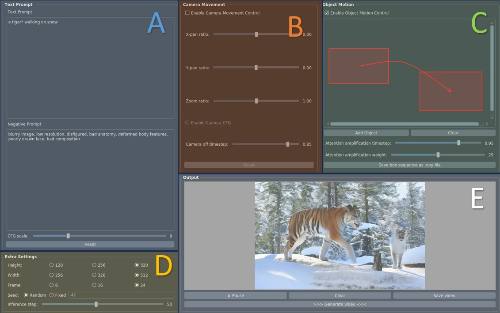

# Direct-a-Video: Customized Video Generation with User-Directed Camera Movement and Object Motion


[![Project](https://img.shields.io/badge/Direct_A_Video-1?label=Project&logo=data:image/svg+xml;charset=utf-8;base64,PHN2ZyB0PSIxNzEyNDkwMTA3NzIxIiBjbGFzcz0iaWNvbiIgdmlld0JveD0iMCAwIDEwMjkgMTAyNCIgdmVyc2lvbj0iMS4xIiB4bWxucz0iaHR0cDovL3d3dy53My5vcmcvMjAwMC9zdmciIHAtaWQ9IjM4NzUiIHdpZHRoPSIyMDAiIGhlaWdodD0iMjAwIj48cGF0aCBkPSJNMTAwMS40MjMyMzggNDk0LjU5MnEyMS41MDQgMjAuNDggMjIuNTI4IDQ1LjA1NnQtMTYuMzg0IDQwLjk2cS0xOS40NTYgMTcuNDA4LTQ1LjA1NiAxNi4zODR0LTQwLjk2LTE0LjMzNnEtNS4xMi00LjA5Ni0zMS4yMzItMjguNjcydC02Mi40NjQtNTguODgtNzcuODI0LTczLjcyOC03OC4zMzYtNzQuMjQtNjMuNDg4LTYwLjQxNi0zMy43OTItMzEuNzQ0cS0zMi43NjgtMjkuNjk2LTY0LjUxMi0yOC42NzJ0LTYyLjQ2NCAyOC42NzJxLTEwLjI0IDkuMjE2LTM4LjQgMzUuMzI4dC02NS4wMjQgNjAuOTI4LTc3LjgyNCA3Mi43MDQtNzUuNzc2IDcwLjY1Ni01OS45MDQgNTUuODA4LTMwLjIwOCAyNy4xMzZxLTE1LjM2IDEyLjI4OC00MC45NiAxMy4zMTJ0LTQ0LjAzMi0xNS4zNnEtMjAuNDgtMTguNDMyLTE5LjQ1Ni00NC41NDR0MTcuNDA4LTQxLjQ3MnE2LjE0NC02LjE0NCAzNy44ODgtMzUuODR0NzUuNzc2LTcwLjY1NiA5NC43Mi04OC4wNjQgOTQuMjA4LTg4LjA2NCA3NC43NTItNzAuMTQ0IDM2LjM1Mi0zNC4zMDRxMzguOTEyLTM3Ljg4OCA4My45NjgtMzguNHQ3Ni44IDMwLjIwOHE2LjE0NCA1LjEyIDI1LjYgMjQuMDY0dDQ3LjYxNiA0Ni4wOCA2Mi45NzYgNjAuOTI4IDcwLjY1NiA2OC4wOTYgNzAuMTQ0IDY4LjA5NiA2Mi45NzYgNjAuOTI4IDQ4LjEyOCA0Ni41OTJ6TTQ0Ny40MzkyMzggMzQ2LjExMnEyNS42LTIzLjU1MiA2MS40NC0yNS4wODh0NjQuNTEyIDI1LjA4OHEzLjA3MiAzLjA3MiAxOC40MzIgMTcuNDA4bDM4LjkxMiAzNS44NHEyMi41MjggMjEuNTA0IDUwLjY4OCA0OC4xMjh0NTcuODU2IDUzLjI0OHE2OC42MDggNjMuNDg4IDE1My42IDE0Mi4zMzZsMCAxOTQuNTZxMCAyMi41MjgtMTYuODk2IDM5LjkzNnQtNDUuNTY4IDE4LjQzMmwtMTkzLjUzNiAwIDAtMTU4LjcycTAtMzMuNzkyLTMxLjc0NC0zMy43OTJsLTE5NS41ODQgMHEtMTcuNDA4IDAtMjQuMDY0IDEwLjI0dC02LjY1NiAyMy41NTJxMCA2LjE0NC0wLjUxMiAzMS4yMzJ0LTAuNTEyIDUzLjc2bDAgNzMuNzI4LTE4Ny4zOTIgMHEtMjkuNjk2IDAtNDcuMTA0LTEzLjMxMnQtMTcuNDA4LTM3Ljg4OGwwLTIwMy43NzZxODMuOTY4LTc2LjggMTUyLjU3Ni0xMzkuMjY0IDI4LjY3Mi0yNi42MjQgNTcuMzQ0LTUyLjczNnQ1Mi4yMjQtNDcuNjE2IDM5LjQyNC0zNi4zNTIgMTkuOTY4LTE4Ljk0NHoiIHAtaWQ9IjM4NzYiIGZpbGw9IiNmZmZmZmYiPjwvcGF0aD48L3N2Zz4=)](https://direct-a-video.github.io/)
[](https://arxiv.org/abs/2402.03162)


> **Direct-a-Video: Customized Video Generation with User-Directed Camera Movement and Object Motion.**
> 
> Shiyuan Yang, Liang Hou, Haibin Huang, Chongyang Ma, Pengfei Wan, Di Zhang, Xiaodong Chen, Jing Liao
>
>
> **TL;DR:** Direct-a-Video is a text-to-video generation framework that allows users to individually or jointly control the camera movement and/or object motion.


## Setup

You may create a new environment:

```bash
conda create --name dav python=3.8
conda activate dav
```

The required python packages are listed in `requirements.txt`, you can install these packages by running :

```bash
pip install -r requirements.txt
```


## Download pretrained models

### Text-to-video base model
We use [Zeroscope_v2_576w](https://huggingface.co/cerspense/zeroscope_v2_576w) as our base model, you can cache it to locally by running the following python code.


```python
import torch
from diffusers import DiffusionPipeline

pipe = DiffusionPipeline.from_pretrained("cerspense/zeroscope_v2_576w", torch_dtype=torch.float16)
```

### Camera module
Based on text-to-video base model, we additionally trained a camera module that enables camera motion control. The camera module is available at
[OneDrive](https://portland-my.sharepoint.com/:u:/g/personal/shiyyang8-c_my_cityu_edu_hk/EeG8gi7Ve7NHng3YI-0MEbcBrUiyTXcIf0wlg47bJqJlbQ?e=S7Ilpb) or [GoogleDrive](https://drive.google.com/file/d/1YDjQQFSQQyUnxCbHMIt54ToksRVLWBqk/view?usp=sharing). Please download it and save to the `./ckpt` directory.


## Run Inference

We prepared two ways to run the inference - either using python notebook or using our qt5-based UI. See instructions below:

### Python notebook
Refer to the `inference.ipynb`, follow the step-by-step instructions and comments inside.


### UI
We also designed a UI (which is based on pyqt5) for interactive use. Here are the instructions:
1. Run the ui launching script `./ui/main_ui.py`, make sure your machine supports graphics display if you are running on a remote server.
    ```bash
     python ui/main_ui.py
    ```
     you'll see the interface below

        


2. Input your prompt in Section A. Instructions on prompt: 
    * Use * to mark the object(s) word and the background word (optional), just append * right after the word.
    For example, "a tiger* and a bear* walking in snow*"
    * If an object has more than one word, use ( ) to wrap them. E.g., a (white tiger) walking in (green grassland)"
    * The mark * and ( ) can be used together, e.g., a tiger* and a (bear) walking in (green grassland)"
    * The marked background word (if any) should always be the last marked word, as seen in the above examples.
3. [optional] Camera motion: set camera movement parameters in Section B, remember to check the enable box first!
4. [optional] Object Motion: draw object motion boxes in Section C:
    * Check the enable box at the top to enable this function.
    * On blank canvas, left-click and drag the mouse to draw a starting box, release the mouse, then left-click and drag the mouse to draw an ending box.
    * Upon releasing the mouse, a straight path will be automatically generated between starting box and ending box. You can right-click somewhere to adjust this path.
    * You can click "add object" button to add another box pair.
5. [optional] You can change the random seed in section D, we do not recommend changing the video resolution.
6. In Section E, click `initialize the model` to initialize the models (done once only before generation).
7. After initialization is done, click `Generate video` button , wait for a while and the output results will be displayed. You can go back to step 3 or 4 or 5 to adjust the input and hyperparamters then generate again.

    Some tips:
    * If the model generates tightly packed box-shape objects, try to increase the attention amplifcation timestep in Section C to higher value like 0.98. You can also decrease the amplifcation weight to lower values like 10.
    * Initial noise is important to output, try with different seeds if not get desired output.


## Training

### Dataset
We use a static shot subset of [Movieshot](https://anyirao.com/projects/ShotType.html) for training the camera motion. We first download the dataset, we then use [BLIP-2](https://huggingface.co/docs/transformers/main/en/model_doc/blip-2) to generate caption for each video. Finally, we make the training data in csv format, see  `./data/example_train_data.csv` for example.

### Start training

The main training script for camera motion is `train_cam.py`. You may want to go through it before running. We prepared a bash file `train_cam_launcher.sh`, where you can set the arguments for launching the training script using Accelerator. We list some useful arguments:
> * --output_dir: the directory to save training outputs, including validation samples, and checkpoints.
> * --train_data_csv: csv file containing training data, see './data/example_train_data.csv' for example.
> * --val_data_csv: csv file containing validation data, see './data/example_val_data.csv' for example.
> * --n_sample_frames: number of video frames
> * --h: video height
> * --w: video width
> * --validation_interval: how many iters to run validation set
> * --checkpointing_interval: how many iters to save ckpt
> * --mixed_precision: can be one of 'no' (i.e.,fp32), 'fp16', or 'bf16' (only on certain GPUs)
> * --gradient_checkpointing: enable this to save memory

After setting up, run the bash script to launch the training:
```bash
bash train_cam_launcher.sh
```


## Citation

```bibtex
@inproceedings{dav24,
  author = {Shiyuan Yang and Liang Hou and Haibin Huang and Chongyang Ma and Pengfei Wan and Di Zhang and Xiaodong Chen and Jing Liao},
  title = {Direct-a-Video: Customized Video Generation with User-Directed Camera Movement and Object Motion},
  booktitle = {Special Interest Group on Computer Graphics and Interactive Techniques Conference Conference Papers '24 (SIGGRAPH Conference Papers '24)},
  year = {2024},
  location = {Denver, CO, USA},
  date = {July 27--August 01, 2024},
  publisher = {ACM},
  address = {New York, NY, USA},
  pages = {12},
  doi = {10.1145/3641519.3657481},
}

```


## Acknowlegment
This repo is mainly built on [Text-to-video diffusers pipeline](https://huggingface.co/docs/diffusers/v0.27.2/en/api/pipelines/text_to_video). Some code snippets in the repo were borrowed from [GLGEN diffusers repo](https://huggingface.co/docs/diffusers/v0.27.2/en/api/pipelines/stable_diffusion/gligen#gligen-grounded-language-to-image-generation) and [DenseDiff repo](https://github.com/naver-ai/DenseDiffusion).
